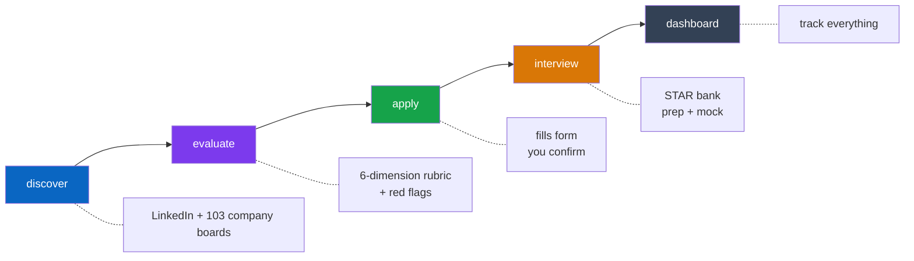
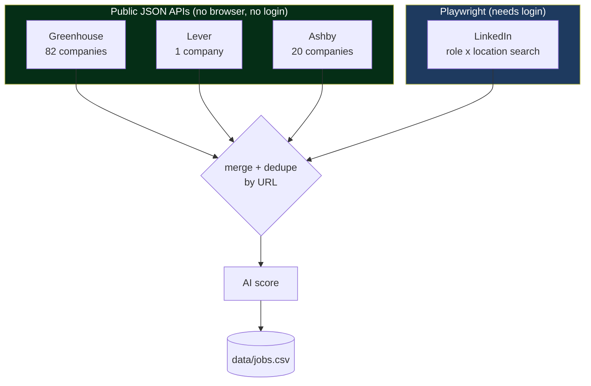
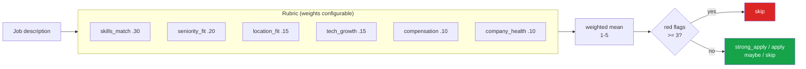
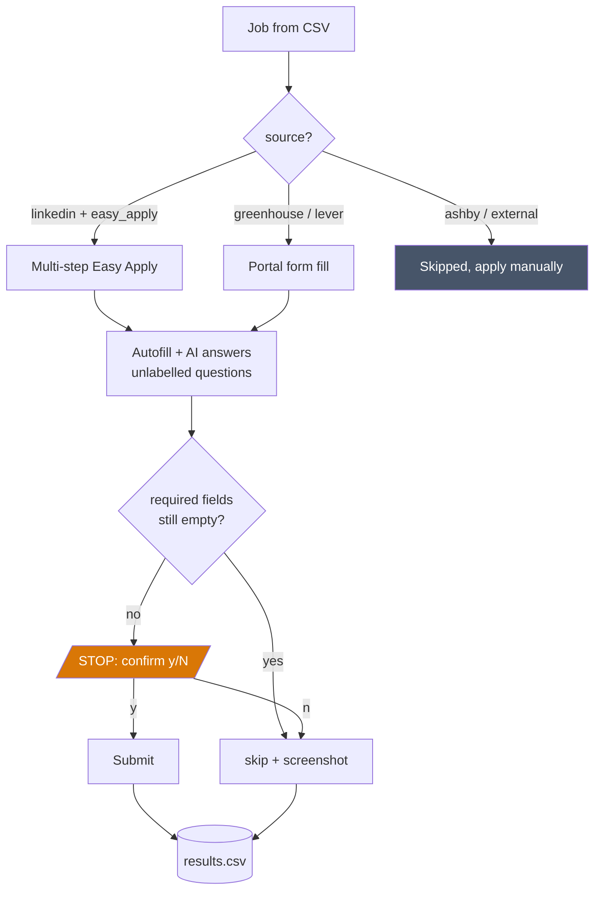

# job-autopilot

> Finds jobs across LinkedIn and 100+ company job boards, evaluates whether each one is worth applying to, fills the application form, and prepares you for the interview. You confirm every submission.

Built with **Node.js · TypeScript · Playwright · Claude**

---

## What it does

Most job tools do one of two things: find postings, or fill forms. This does both, plus the judgement step in between.



| Command | What it does |
|---|---|
| `npm run discover` | Finds jobs on LinkedIn **and** 103 company boards, scores each one |
| `npm run evaluate` | Deep-scores against a weighted rubric, flags ghost/scam postings |
| `npm run apply` | Fills LinkedIn Easy Apply, Greenhouse, and Lever forms |
| `npm run interview` | STAR story bank, role-specific prep, mock interview with feedback |
| `npm run dashboard` | Live web UI at `localhost:3000` |

---

## Where jobs come from

LinkedIn is scraped with Playwright. Company boards use each ATS's **public JSON API**, so there is no browser, no login, and no scraping involved.



Because portals need no login, `--portals-only` finds jobs without opening a browser at all:

```bash
npm run discover -- --portals-only    # fast, no browser, no LinkedIn
npm run discover -- --skip-portals    # LinkedIn only
npm run discover                      # both
```

Company boards live in `data/companies.json`. Every one of the 103 tokens shipped in `data/companies.example.json` was verified live against its API. A token that stops working is skipped with a warning, never aborting the run.

---

## How a job is judged

`evaluate` scores six dimensions 1-5, takes a weighted mean, then applies a red-flag gate. Weights and thresholds are all config, not code.



Red flags are only raised with evidence from the posting: vague responsibilities, missing compensation where legally expected, unrealistic requirements, ghost-listing signals, excessive unpaid assessments, unclear employer identity.

---

## Applying



**It never auto-submits.** Every submission stops for your confirmation, on every portal.

---

## Setup

```bash
npm install
npx playwright install chromium

cp config.example.json config.json          # only `phone` is required
cp data/profile.example.json data/profile.json
cp data/companies.example.json data/companies.json
```

Put your resume and cover letter in `data/documents/`, then point `config.json` at them.

```text
data/
├── profile.json          your details, target roles, locations
├── companies.json        103 verified company board tokens
├── documents/            resume + cover letter (PDF)
├── assets/               images (not used by code)
├── jobs.csv              current discovery run
└── jobs_history.csv      accumulates across runs, never loses a job
```

### Optional

| Env var | Enables |
|---|---|
| `ANTHROPIC_API_KEY` | AI scoring, evaluation, form answers, interview tools |
| `LINKEDIN_PASSWORD` | Pre-fills the login form |
| `SUPABASE_URL` + `SUPABASE_SERVICE_ROLE_KEY` | Live dashboard sync |

Everything except the interview tools works without an API key.

---

## Running it

```bash
npm run discover                  # find jobs
npm run evaluate -- --limit 25    # judge the best 25
npm run apply                     # apply, confirming each one
npm run dashboard                 # track results
```

Interview prep, once you have an interview:

```bash
npm run interview stories         # build your STAR bank (once)
npm run interview prep stripe     # questions, gaps, what to ask them
npm run interview practice 3      # mock interview on job #3, with feedback
```

`prep` and `practice` accept a row number from `jobs.csv`, a company name, or a job URL.

---

## Configuration

Everything below is optional and shown with its default. See `config.example.json` for the full file.

```jsonc
{
  "sources": {
    "linkedin": { "enabled": true, "maxJobs": 100, "maxPerRole": 10 },
    "portals":  { "enabled": true, "concurrency": 5, "maxPerCompany": 25,
                  "greenhouse": true, "lever": true, "ashby": true }
  },
  "filters": {
    "excludeTitlePatterns": ["intern", "trainee", "fresher"],
    "allowRemote": true,
    "requireLocationMatch": true
  },
  "evaluation": {
    "weights":    { "skills_match": 0.30, "seniority_fit": 0.20, "location_fit": 0.15,
                    "tech_growth": 0.15, "compensation": 0.10, "company_health": 0.10 },
    "thresholds": { "strong_apply": 4.2, "apply": 3.4, "maybe": 2.5 },
    "redFlagSkipCount": 3
  },
  "interview": { "questionsPerSession": 8 }
}
```

Weights are normalised, so they need not sum to 1. Care more about compensation than growth? Change the numbers, not the code.

---

## Results

Every attempt is logged to `results.csv` and shown in the dashboard.

| Status | Meaning |
|---|---|
| `applied` | You confirmed the submission |
| `skipped` | Not fillable, required fields empty, or you declined |
| `failed` | Error, retried on the next run |

Applied jobs are never retried. Failed and skipped ones are.

---

## Logging in

Only LinkedIn needs a login. Portal discovery is unauthenticated, so `--portals-only` never prompts for one.

There are three ways in, tried in this order:

### 1. Reuse the Chrome you're already logged into (no login at all)

Start Chrome with a debugging port open, then run as normal. Playwright attaches to that Chrome and reuses its real profile, so if you're already signed into LinkedIn there is nothing to log in to.

```bash
# macOS
/Applications/Google\ Chrome.app/Contents/MacOS/Google\ Chrome --remote-debugging-port=9222

npm run discover
# → Connected to existing Chrome on port 9222 — reusing its logged-in session.
```

Override the port with `CHROME_CDP_PORT`. Quit Chrome fully before starting it this way, or the flag is ignored.

### 2. Cached session file

After a manual login, the session is saved to `.linkedin-session.json` and reused for **24 hours**, so `discover` and `apply` back-to-back need only one login. The file is gitignored and never committed.

### 3. Manual login

Falls back to opening the login page. Set `LINKEDIN_PASSWORD` to pre-fill it.

---

## Safety

- **Never auto-submits**, on any portal
- Browser runs visible so you see every action
- `autoSkipUnansweredRequired` prevents incomplete submissions
- External and Ashby jobs are skipped instantly, no browser opened
- Portal APIs are read-only and unauthenticated

---

## Docs

[docs/ARCHITECTURE.md](docs/ARCHITECTURE.md) covers the design decisions, tradeoffs, and failure modes.
