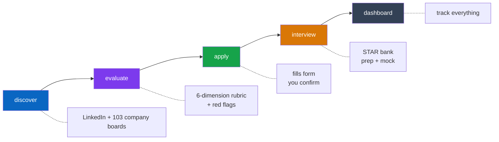
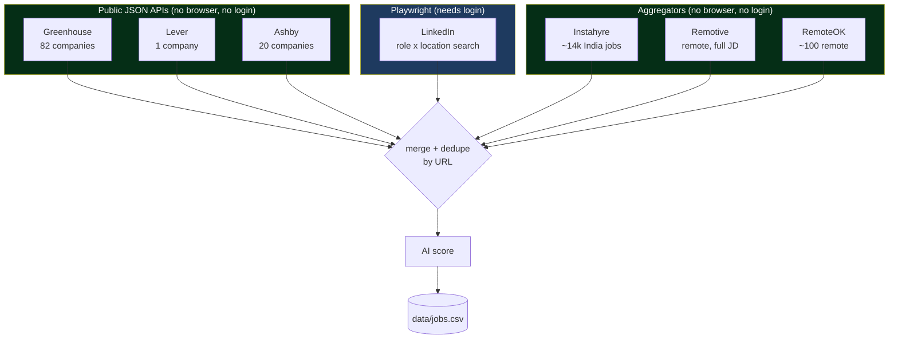
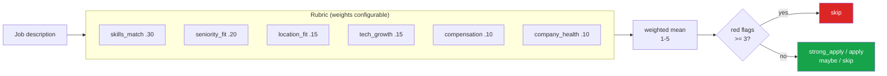
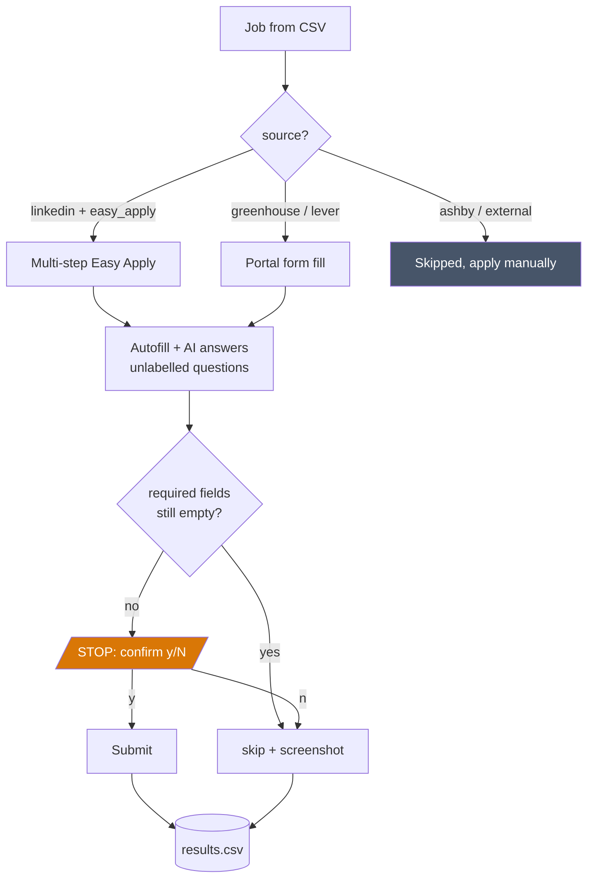

# job-autopilot

> Finds jobs across LinkedIn and 100+ company job boards, evaluates whether each one is worth applying to, fills the application form, and prepares you for the interview. You confirm every submission.

Built with **Node.js · TypeScript · Playwright · Claude**

---

## What it does

Most job tools do one of two things: find postings, or fill forms. This does both, plus the judgement step in between.



| Command | What it does |
|---|---|
| `npm run discover` | Finds jobs on LinkedIn, 103 company boards, and 3 aggregators |
| `npm run harvest` | Collects LinkedIn jobs through a browser you are already signed into |
| `npm run import` | Ingests harvested jobs into the CSVs |
| `npm run evaluate` | Scores each job on six weighted dimensions, flags ghost and scam postings |
| `npm run apply` | Fills LinkedIn Easy Apply, Greenhouse, and Lever forms |
| `npm run interview` | STAR story bank, role-specific prep, mock interview with feedback |
| `npm run dashboard` | Local web UI at `localhost:3000` |

---

## Where jobs come from

LinkedIn is scraped with Playwright. Company boards use each ATS's **public JSON API**, so there is no browser, no login, and no scraping involved.



Because portals need no login, `--portals-only` finds jobs without opening a browser at all:

```bash
npm run discover -- --portals-only    # fast, no browser, no LinkedIn
npm run discover -- --skip-portals    # LinkedIn only
npm run discover                      # both
```

Company boards live in `data/companies.json`. Every one of the 103 tokens shipped in `data/companies.example.json` was verified live against its API. A token that stops working is skipped with a warning, never aborting the run.

### Aggregators

Three job aggregators are also supported. These have no per-company token: each returns a broad feed that is filtered against your profile locally.

| Source | Coverage | Notes |
|---|---|---|
| Instahyre | ~14,000 India-focused jobs | Paginated; ignores search params, so filtering is local |
| Remotive | Remote jobs, full descriptions | Server-side search, one query per target role |
| RemoteOK | ~100 remote jobs | Their terms ask for a link back when reusing the feed |

Naukri, Hirist, and Wellfound were checked and have **no usable public API** (Naukri requires private auth headers; the other two return 404).

Aggregator titles often differ from ATS conventions, so a role like `Backend Engineer` will not match a posting titled `Software Development Engineer III`. Add the variants you care about to `preferredRoles` in `data/profile.json`.

---

## How a job is judged

`evaluate` scores six dimensions 1-5, takes a weighted mean, then applies a red-flag gate. Weights and thresholds are all config, not code.



Red flags are only raised with evidence from the posting: vague responsibilities, missing compensation where legally expected, unrealistic requirements, ghost-listing signals, excessive unpaid assessments, unclear employer identity.

---

## Applying



**It never auto-submits.** Every submission stops for your confirmation, on every portal.

---

## Dashboard

`npm run dashboard` opens a local, dark, monospace-numbered triage view at `localhost:3000` — not a report, a queue of what to act on today.

- **A left rail on every row** encodes two things at once: hue is the source (LinkedIn blue, Greenhouse green, Instahyre pink...), opacity is how fresh the posting is. A glance down the edge tells you where jobs came from and how stale they are, with no need to read a column.
- **Time-group dividers** — Today / Last 3 days / This week / This month / Older / No posting date — so freshness is structural, not just a tint, while sorted by age.
- **Click a row to expand it** and see the `reason` the evaluator gave and the full job description — both already collected on every job, previously invisible anywhere in the UI.
- **Tabs per source**, plus free-text search and status/role filters.
- **A triage strip up top**: ready to apply, posted today, applied, red flagged, no date — zero counts dim out instead of competing for attention with the numbers that matter.

The client polls `/api/jobs` every 15s and only replaces the row list, so filters, scroll position, and expanded rows all survive a refresh. The endpoint ETags its response, so a poll that finds nothing new costs a `304` with an empty body rather than resending the dataset.

Three routes, no authentication on any of them:

| Route | Returns |
|---|---|
| `/` | The shell — palette, layout, triage strip, filter controls |
| `/api/jobs` | `{ rows, summary }` JSON the client polls. Descriptions are truncated to what an expanded row renders (1600 chars); the response is ETag'd so a poll that finds nothing new gets a `304` with an empty body instead of the full payload |
| `/app.js` | The client script, served from `src/dashboard/client.js` so it stays a real, lintable file rather than an inline string |

**It only listens on `127.0.0.1`.** Because no route authenticates, binding to every interface would let anyone on the same network open `/api/jobs` and read every job and its full description. Set `DASHBOARD_HOST=0.0.0.0` to expose it deliberately — the startup log warns when you do.

```bash
DASHBOARD_PORT=4000 npm run dashboard    # different port
DASHBOARD_HOST=0.0.0.0 npm run dashboard # reachable from your LAN — no auth, use with care
```

---

## Setup

```bash
npm install
npx playwright install chromium

cp config.example.json config.json          # only `phone` is required
cp data/profile.example.json data/profile.json
cp data/companies.example.json data/companies.json
```

Put your resume and cover letter in `data/documents/`, then point `config.json` at them.

```text
data/
├── profile.json          your details, target roles, locations
├── companies.json        103 verified company board tokens
├── documents/            resume + cover letter (PDF)
├── assets/               images (not used by code)
├── jobs.csv              current discovery run
└── jobs_history.csv      accumulates across runs, never loses a job
```

### Optional

| Env var | Enables |
|---|---|
| `ANTHROPIC_API_KEY` | AI scoring, evaluation, form answers, interview tools |
| `LINKEDIN_PASSWORD` | Pre-fills the login form |
| `LINKEDIN_SESSION_DAYS` | Override the 14-day cached-session TTL |
| `CHROME_CDP_PORT` | Override the 9222 default for attaching to a dedicated Chrome |
| `DASHBOARD_PORT` / `DASHBOARD_HOST` | Dashboard listen address, default `127.0.0.1:3000` |
| `SUPABASE_URL` + `SUPABASE_SERVICE_ROLE_KEY` | Live dashboard sync |

Everything except the interview tools works without an API key.

---

## Running it

```bash
npm run discover                  # find jobs
npm run evaluate -- --limit 25    # judge the best 25
npm run apply                     # apply, confirming each one
npm run dashboard                 # track results
```

Interview prep, once you have an interview:

```bash
npm run interview stories         # build your STAR bank (once)
npm run interview prep stripe     # questions, gaps, what to ask them
npm run interview practice 3      # mock interview on job #3, with feedback
```

`prep` and `practice` accept a row number from `jobs.csv`, a company name, or a job URL.

---

## Configuration

Everything below is optional and shown with its default. See `config.example.json` for the full file.

```jsonc
{
  "sources": {
    "linkedin": { "enabled": true, "maxJobs": 100, "maxPerRole": 10 },
    "portals":  { "enabled": true, "concurrency": 5, "maxPerCompany": 25,
                  "greenhouse": true, "lever": true, "ashby": true },
    "aggregators": { "enabled": true, "maxPages": 20, "limitPerQuery": 50,
                      "instahyre": true, "remotive": true, "remoteok": true }
  },
  "filters": {
    "excludeTitlePatterns": ["intern", "trainee", "fresher"],
    "allowRemote": true,
    "requireLocationMatch": true
  },
  "evaluation": {
    "weights":    { "skills_match": 0.30, "seniority_fit": 0.20, "location_fit": 0.15,
                    "tech_growth": 0.15, "compensation": 0.10, "company_health": 0.10 },
    "thresholds": { "strong_apply": 4.2, "apply": 3.4, "maybe": 2.5 },
    "redFlagSkipCount": 3
  },
  "interview": { "questionsPerSession": 8 }
}
```

Weights are normalised, so they need not sum to 1. Care more about compensation than growth? Change the numbers, not the code.

---

## Results

Every attempt is logged to `results.csv` and shown in the dashboard.

| Status | Meaning |
|---|---|
| `applied` | You confirmed the submission |
| `skipped` | Not fillable, required fields empty, or you declined |
| `failed` | Error, retried on the next run |

Applied jobs are never retried. Failed and skipped ones are.

---

## Logging in

Only LinkedIn needs a login. Portal discovery is unauthenticated, so `--portals-only` never prompts for one.

There are three ways in, tried in this order:

### 1. Attach to a Chrome you control (no login after the first time)

If a Chrome is listening on the debugging port, Playwright attaches to it and reuses that profile's cookies, so there is nothing to log in to.

```bash
# macOS — note the dedicated profile directory, it is required
/Applications/Google\ Chrome.app/Contents/MacOS/Google\ Chrome \
  --remote-debugging-port=9222 \
  --user-data-dir="$HOME/.job-autopilot-chrome"

npm run discover
# → Connected to existing Chrome on port 9222 — reusing its logged-in session.
```

Log into LinkedIn once in that window. The profile directory persists, so every later run reuses it with no login and no 24-hour expiry.

**`--user-data-dir` is not optional.** Since Chrome 136 (May 2025), Chrome silently ignores `--remote-debugging-port` when running on the **default** profile — a security fix that stops malware from stealing cookies over CDP. The flag is accepted, the port never opens, and the only clue is a warning on stderr. So attaching to your everyday, already-signed-in Chrome is not possible on current Chrome; the dedicated profile above is the supported route.

Override the port with `CHROME_CDP_PORT`.

### 2. Cached session file

After a manual login, the session is saved to `.linkedin-session.json` and reused for **14 days** (override with `LINKEDIN_SESSION_DAYS`), so `discover` and `apply` need only one login. The file is gitignored and never committed.

### 3. Manual login

Falls back to opening the login page. Set `LINKEDIN_PASSWORD` to pre-fill it.

---

## Safety

- **Never auto-submits**, on any portal
- Browser runs visible so you see every action
- `autoSkipUnansweredRequired` prevents incomplete submissions
- External and Ashby jobs are skipped instantly, no browser opened
- Portal APIs are read-only and unauthenticated

---

## Docs

[docs/ARCHITECTURE.md](docs/ARCHITECTURE.md) covers the design decisions, tradeoffs, and failure modes.
